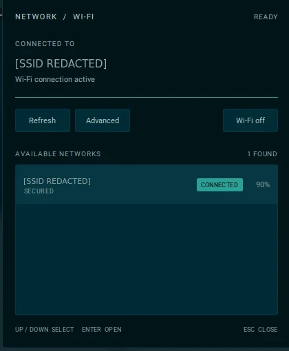
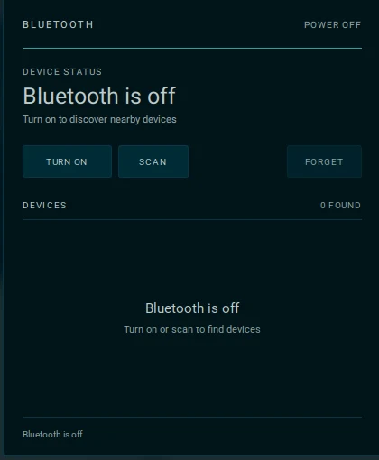
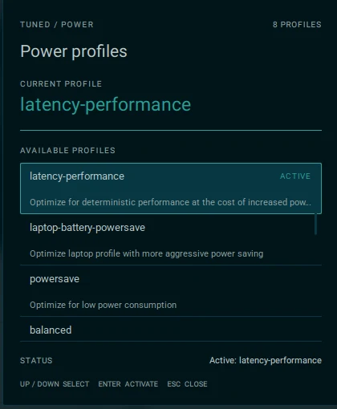
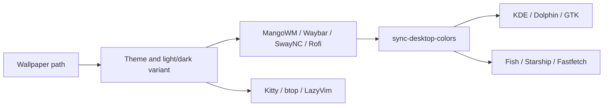

<div align="center">

# MangoWM Dotfiles

**A cohesive, wallpaper-driven Wayland desktop for Artix Linux.**

[](https://artixlinux.org/) [](https://wayland.freedesktop.org/) [](https://github.com/mangowm/mango)


<sub>MangoWM · Waybar · SwayNC · Rofi · Kitty · btop · LazyVim · OpenRC</sub>

<br><br>

[Showcase](#showcase) · [Features](#highlights) · [Install](#installation) · [Keybindings](#keybindings) · [Architecture](#dynamic-theming)

</div>

## Showcase

<table>
  <tr>
    <td width="50%">
      
      <br>
      <sub><b>Wallpaper gallery</b> — search, browse, preview, and recolor the complete desktop.</sub>
    </td>
    <td width="50%">
      
      <br>
      <sub><b>Command center</b> — a focused Rofi launcher using the generated palette.</sub>
    </td>
  </tr>
</table>

### Instrument popups · current Osaka palette

<table>
  <tr>
    <td width="33%"><br><sub><b>Wi-Fi</b> — connection, scan, and network actions.</sub></td>
    <td width="33%"><br><sub><b>Bluetooth</b> — power-off state and device controls.</sub></td>
    <td width="33%"><br><sub><b>TuneD</b> — active profile and available modes.</sub></td>
  </tr>
</table>

Captured from the live Qt popups; the Wi-Fi SSID is redacted before publication. Popup accents and surfaces follow the active theme.

> One wallpaper selection regenerates a consistent palette across the compositor, shell, terminal, launcher, notifications, GTK, KDE, and folder icons.

This repository is an audited snapshot of the active desktop—not a loose collection of example configs. It excludes credentials, personal media, caches, generated binaries, and stale settings from other desktop sessions. The complete inclusion policy lives in [`AUDIT.md`](AUDIT.md).

## Desktop stack

| Layer | Choice |
|---|---|
| Distribution / init | Artix Linux / OpenRC |
| Login / session | SDDM / Wayland |
| Compositor | MangoWM |
| Bar / notifications | Waybar / SwayNC |
| Launcher / terminal | Rofi / Kitty |
| Shell / prompt | Fish / Starship |
| Wallpaper / colors | Custom Qt gallery / curated named palettes |
| Audio / network | PipeWire + WirePlumber / NetworkManager |
| Desktop integration | Dolphin + KDE colors + GTK3/GTK4 CSS |

## Highlights

- **One-command recoloring.** Named wallpaper folders apply curated palettes to MangoWM, Waybar, SwayNC, Rofi, Kitty, btop, LazyVim, Fish, Starship, Fastfetch, KDE, GTK, and Breeze folder icons; ungrouped wallpapers use Material Dark.
- **Consistent terminal workflow.** Rofi, btop, and Neovim open through Kitty; Neovim owns text and source-code MIME types.
- **Purpose-built desktop tools.** Native Qt wallpaper gallery, matching Wi-Fi, Bluetooth, and TuneD profile popups, plus a volume/brightness OSD.
- **Responsive workflow.** Nine tags, directional navigation, touchpad gestures, blur, animations, scratchpads, and a compact status bar.
- **Selectable Waybar layouts.** Switch between a full-width bar and floating dock from the status module; the choice survives installer refreshes.
- **Event-driven status.** Custom Mango tag indicators update from compositor IPC instead of polling through `jq`.
- **Audited deployment.** The installer adapts hardware names, builds local tools from source, configures OpenRC services, and backs up every conflict.
- **Repeatable installation.** Identical files and matching symlinks are left untouched, making subsequent installs idempotent.

## Installation

### Supported target

The automatic package and service setup targets **Artix Linux with OpenRC**. Config-only installation is possible on another Arch-family environment with the skip options described below.

### Normal installation

```bash
git clone https://github.com/alertxsto/mangowm-dotfiles.git ~/mangowm-dotfiles
cd ~/mangowm-dotfiles
./install.sh
```

The installer may request `sudo` for packages and system OpenRC services. It runs AUR package builds as the regular user.

After installation:

1. Put at least one `.jpg`, `.jpeg`, `.png`, or `.webp` image under `~/Pictures`.
2. Log out.
3. Select **Mango** in SDDM.
4. Log back in.
5. Press `Super+W` to choose a wallpaper, or run `theme-wallpaper /path/to/image`.

A generated fallback palette is included, so Waybar and the desktop remain usable even before a wallpaper is available.

### Installer options

```text
--target-home PATH  Install into PATH instead of $HOME
--skip-packages     Do not install pacman/AUR packages
--skip-services     Do not enable OpenRC services
--skip-build        Do not build the native Qt utilities
-h, --help          Show installer help
```

Examples:

```bash
# Install only the configuration files
./install.sh --skip-packages --skip-services

# Populate an isolated home for inspection
./install.sh \
  --target-home /tmp/mango-home \
  --skip-packages \
  --skip-services
```

When `--target-home` differs from `$HOME`, use `--skip-services`; user OpenRC services belong to the real login account. The installer also scopes XDG configuration and data paths to the target home while registering application defaults.

## What `install.sh` does

1. Verifies that the package-install path is running on Artix Linux.
2. Bootstraps `yay` when necessary.
3. Installs repository and AUR dependencies listed in [`packages.txt`](packages.txt).
4. Copies the tracked home tree into the selected target home.
5. Replaces `__HOME__` placeholders with the actual target path.
6. Registers Kitty and Neovim as desktop defaults and restores the selected Waybar layout.
7. Detects the Wi-Fi interface and backlight device.
8. Builds the Wi-Fi, Bluetooth, TuneD profile, OSD, and wallpaper utilities from source.
9. Replaces `power-profiles-daemon` with TuneD, installs its PPD mapping and OpenRC service, then enables required system and user services.

### Existing-file safety

The installer never silently discards a conflicting file. Changed destinations are moved to:

```text
~/.dotfiles-backup/YYYYMMDD-HHMMSS-PID/
```

Identical files and matching symlinks are left in place. Re-running the installer is idempotent.

## Repository layout

```text
.
├── .config/
│   ├── mango/                 # compositor, rules, bindings, startup
│   ├── waybar/                # switchable bar/dock modules and styling
│   ├── swaync/                # notifications and control center
│   ├── rofi/                  # launcher
│   ├── kitty/                 # terminal
│   ├── btop/                  # generated activity monitor theme
│   ├── nvim/                  # LazyVim setup and generated Mango palette
│   ├── fish/                  # shell startup and generated colors
│   ├── fastfetch/             # generated layout and image
│   ├── gtk-3.0/               # GTK3 palette integration
│   ├── gtk-4.0/               # GTK4/libadwaita integration
│   ├── fontconfig/            # icon-font fallback aliases
│   ├── xsettingsd/            # GTK/XSettings bridge
│   └── xdg-desktop-portal/    # Wayland screen-capture routing
├── .local/
│   ├── bin/                   # shell and Python helpers
│   └── share/
│       ├── network-popup/     # Qt Wi-Fi popup source
│       ├── bluetooth-popup/   # Qt Bluetooth popup source
│       ├── tuned-popup/       # Qt TuneD profile selector source
│       ├── mango-osd/         # Qt OSD source
│       ├── wallpaper-overview/ # Qt wallpaper gallery source
│       ├── applications/      # terminal-first desktop launchers
│       └── color-schemes/     # KDE fallback color scheme
├── system/                    # TuneD profile mapping and OpenRC service
├── AUDIT.md                   # system audit and exclusions
├── packages.txt               # repository, AUR, and OpenRC packages
└── install.sh                 # installer, builder, and service setup
```

## Dynamic theming



The main entry point is:

```bash
theme-wallpaper /path/to/wallpaper.png
```

Wallpapers under `~/Pictures/Wallpapers/<Theme>/<Dark|Light>/` select the
matching curated palette. Supported families are Catppuccin, Dracula,
Everforest, Gruvbox, Material, Nord, Osaka, and Rose Pine. Images outside that
layout use Material Dark instead of deriving unstable colors from image pixels.

Without an argument, it uses this precedence:

1. The last selected wallpaper from `~/.cache/mango-theme/wallpaper`.
2. `~/Pictures/blinders.jpg` when present.
3. The first supported image under `~/Pictures`.
4. The tracked fallback palette when no image exists.

The theme command reloads MangoWM, Waybar, Kitty, btop, and SwayNC after regenerating colors. Running LazyVim instances watch the generated palette and recolor immediately; Fish reloads its generated colors at the next prompt.

### Cursor theme

The cursor is declared once, in `~/.config/mango/config.conf`:

```conf
cursor_theme=Bibata-Modern-Classic
cursor_size=24
```

Mango derives `XCURSOR_THEME`/`XCURSOR_SIZE` from those keys for its own pointer
and for every child process. Other toolkits keep private copies, so
`sync-cursor` mirrors the two values into all of them and notifies running
applications:

| Consumer | Store |
|---|---|
| Waybar and other GTK3/GTK4 apps on Wayland | `dconf` `org.gnome.desktop.interface cursor-theme`, served through the settings portal |
| GTK3/GTK4 on X11 and portal-less sessions | `settings.ini` keys |
| GTK2 | `~/.gtkrc-2.0` |
| Qt via the KDE platform theme | `kcminputrc` `[Mouse]` |
| XSettings consumers | `xsettingsd.conf` |
| The theme named `default` | `~/.icons/default/index.theme` |

`sync-cursor` runs at session start and is idempotent. After editing the two
Mango keys, apply them everywhere with:

```bash
sync-cursor
```

Editing only `settings.ini` is not enough: on Wayland, GTK resolves the cursor
through the settings portal, whose value comes from dconf.

### Waybar layouts

Waybar ships with a full-width `bar` profile and an inset `dock` profile. The
`Bar`/`Dock` status module runs `~/.config/waybar/mode.sh toggle`, replaces the
active config and stylesheet, restarts Waybar, and records the choice in
`~/.config/waybar/.mode`. `install.sh` reapplies that profile after refreshing
the tracked files.

The TuneD indicator reads `/etc/tuned/active_profile` every two seconds.
Reading the daemon-maintained file avoids repeatedly starting Python via
`tuned-adm active`; clicking the indicator still opens the profile selector.

## Custom utilities

### Connectivity popups

`network-popup` is a Qt Quick Wi-Fi frontend backed by `nmcli`.

- Scans and sorts access points by connection state and signal strength.
- Connects to open or secured networks.
- Opens `nmtui` for advanced configuration.

`bluetooth-popup` is a matching frontend backed by `bluetoothctl`.

- Powers Bluetooth on or off and scans for nearby devices.
- Pairs, trusts, connects, disconnects, and forgets devices.

Launch either popup from its Waybar module. Clicking the same module again, pressing
Escape, or moving focus away closes it.

### TuneD power profiles

The Waybar gauge opens `tuned-popup`, a focused selector for laptop-relevant
TuneD profiles. The installer replaces `power-profiles-daemon` with
`tuned-ppd`, maps PPD power saver to `laptop-battery-powersave`, builds the
popup from source, and enables both `tuned` and `tuned-ppd` through OpenRC.

The Wi-Fi, Bluetooth, and TuneD popups share an Instrument-style Qt Quick UI:
sharp-edged controls, a live status summary, and a flat list with separate
keyboard selection and connected/active indicators. Each popup reads the
generated `~/.config/rofi/colors.rasi` palette when opened, so the accent and
surfaces follow the selected wallpaper theme rather than a fixed color. Reopen
an already-open popup after changing themes to load the new palette.

### `mango-osd`

Qt Quick OSD backed by a per-user local socket.

```bash
mango-osd --server
mango-osd volume 70 0
mango-osd brightness 80
```

The server starts with MangoWM. `volume-control` and `brightness-control` send updates to it.

### `wallpaper-overview`

Floating Qt Quick wallpaper browser with animated keyboard and pointer navigation.

- Scans `Pictures/Wallpapers` recursively plus images directly under `Pictures`; screenshot and application-output folders stay excluded.
- Uses one stable selected frame; every wallpaper is cropped inside it so image pixels never cross the border.
- Groups images by folder.
- Supports category navigation and text filtering.
- Generates cached 16:9 previews.
- Applies the selected image through `theme-wallpaper`.

## Keybindings

### Applications and desktop

| Binding | Action |
|---|---|
| `Super+D` | Open Rofi |
| `Super+Return` | Open Kitty |
| `Super+E` | Open Dolphin |
| `Super+W` | Open wallpaper gallery |
| `Super+R` | Regenerate colors from the current wallpaper |
| `Print` | Select and capture a screen region; save and copy it |
| `Super+Shift+S` | Select a screen region, annotate in floating Satty, then copy the edited image with `Ctrl+C` |
| `Super+Q` | Close focused client |
| `Super+M` | Exit MangoWM |

### Focus and window state

| Binding | Action |
|---|---|
| `Super+Arrow` | Focus in a direction |
| `Super+Shift+Arrow` | Exchange windows |
| `Super+V` | Toggle floating |
| `Super+F` | Toggle fullscreen |
| `Alt+A` | Toggle maximized screen state |
| `Alt+Shift+F` | Toggle fake fullscreen |
| `Super+G` | Toggle global/sticky state |
| `Super+I` | Minimize |
| `Super+Shift+I` | Restore minimized client |
| `Super+O` | Toggle overlay |
| `Alt+Z` | Toggle scratchpad |
| `Alt+Tab` | Jump between windows |
| `Super+N` | Switch layout |

### Tags and monitors

| Binding | Action |
|---|---|
| `Super+1..9` | View tag |
| `Super+Shift+1..9` | Move client to tag and follow |
| `Ctrl+Left/Right` | View adjacent tag |
| `Alt+Shift+Left/Right` | Focus adjacent monitor |
| `Super+Alt+Left/Right` | Move client to adjacent monitor |


### Workspace layouts

All nine tags default to `dwindle` (Hyprland-style). `Super+1..9` switches tags; `Super+N` changes the current tag's layout. To change the defaults, edit the `layout_name` rules in `~/.config/mango/config.conf`.

### Geometry

| Binding | Action |
|---|---|
| `Super+Ctrl+Arrow` | Resize floating window |
| `Ctrl+Shift+Arrow` | Move floating window |
| `Alt+Shift+R` | Toggle gaps |
| `Alt+Shift+X/Z` | Increase/decrease gaps |
| `Super+left mouse` | Move/resize interaction |
| `Super+right mouse` | Resize interaction |

Hardware brightness and volume keys call the custom controls and display the OSD.

## Hardware adaptation

The checked-in configuration reflects the audited machine, but the installer rewrites two hardware-specific defaults:

- `wlan0` becomes the first non-P2P Wi-Fi interface reported by NetworkManager.
- `amdgpu_bl2` becomes the first device under `/sys/class/backlight`.

Manual overrides remain available:

```bash
BACKLIGHT_DEVICE=intel_backlight brightness-control up
BACKLIGHT_STEP=10 brightness-control down
VOLUME_STEP=2 volume-control up
```

## Updating

Pull changes and run the installer again:

```bash
cd ~/mangowm-dotfiles
git pull --ff-only
./install.sh
```

Changed local destinations are backed up before replacement.

To regenerate the desktop after editing a named palette:

```bash
theme-wallpaper
```

Validate the Mango config without starting another compositor:

```bash
mango -p -c ~/.config/mango/config.conf
```

## Troubleshooting

### Waybar does not start on login

Run it directly to inspect its configuration:

```bash
waybar --log-level debug
```

The Mango config intentionally runs `theme-wallpaper` before `waybar`. Do not split them into concurrent startup commands; the theme helper reload signal can race Waybar startup.

### Brave notifications appear as application windows

SwayNC must own `org.freedesktop.Notifications` before Brave starts:

```bash
busctl --user status org.freedesktop.Notifications
```

The installer publishes the session bus address through `.pam_environment`, and
the user Brave launcher supplies it immediately through `brave-session`. The
wrapper discovers the installed Brave executable (`brave-beta`,
`brave-browser-beta`, `brave-browser`, or `brave`), so the fix is not tied to
one package path. Fully quit Brave and installed Brave web apps before
reopening them. Sign out once after the first install so every Mango-launched
application inherits the bus address directly.

### OBS screen capture under Mango

OBS needs PipeWire and the wlroots desktop-portal backend for Wayland capture.
`packages.txt` installs `xdg-desktop-portal-wlr`, while
`~/.config/xdg-desktop-portal/mango-portals.conf` routes only `ScreenCast`,
`Screenshot`, and `RemoteDesktop` to `wlr`; GTK remains the default for other
portal dialogs.

After installing or changing the portal backend, log out and back in, then
choose OBS's `Screen Capture (PipeWire)` source. Verify the backend services
with:

```bash
ps -ef | grep -E 'xdg-desktop-portal($|-[a-z])' | grep -v grep
```

### No wallpaper is applied

```bash
find ~/Pictures -type f \( -iname '*.jpg' -o -iname '*.jpeg' -o -iname '*.png' -o -iname '*.webp' \)
theme-wallpaper /full/path/to/image.png
```

### Wi-Fi popup shows no networks

```bash
nmcli -t -f DEVICE,TYPE,STATE device
```

Re-run `install.sh` after changing hardware so it can adapt the interface before rebuilding the popup.

### Brightness keys fail

```bash
brightnessctl --list
BACKLIGHT_DEVICE=your_device brightness-control get
```

### Restore a replaced file

Find the newest backup:

```bash
find ~/.dotfiles-backup -maxdepth 2 -type f
```

Then copy the desired file back to its original relative path.

## Security and privacy

The repository does not track GitHub credentials, browser profiles, PulseAudio cookies, personal wallpapers, runtime databases, crash reports, caches, or session restore data. Generated native binaries are also excluded and rebuilt locally.

For the complete evidence-backed coverage list and intentional exclusions, read [`AUDIT.md`](AUDIT.md).
