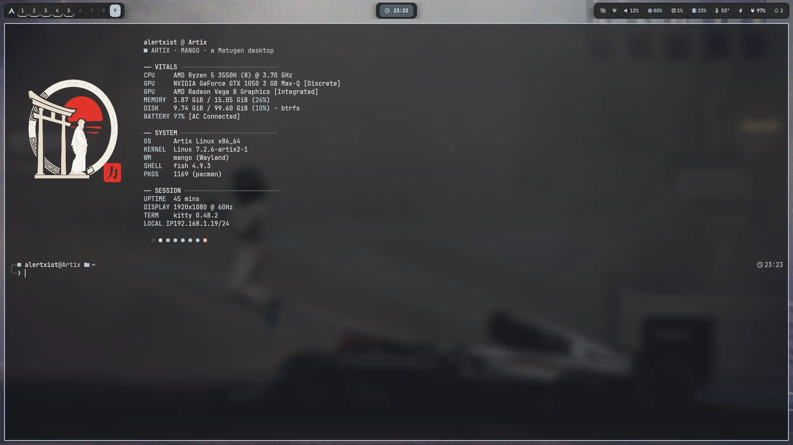
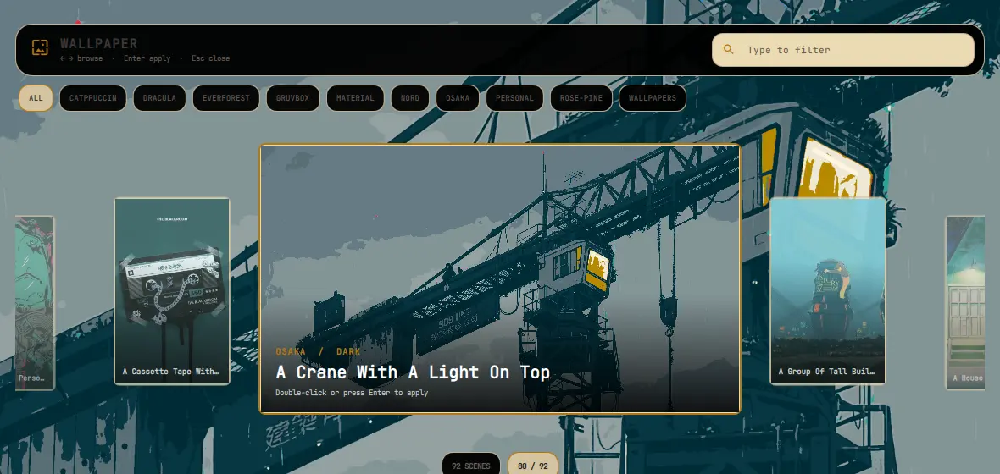
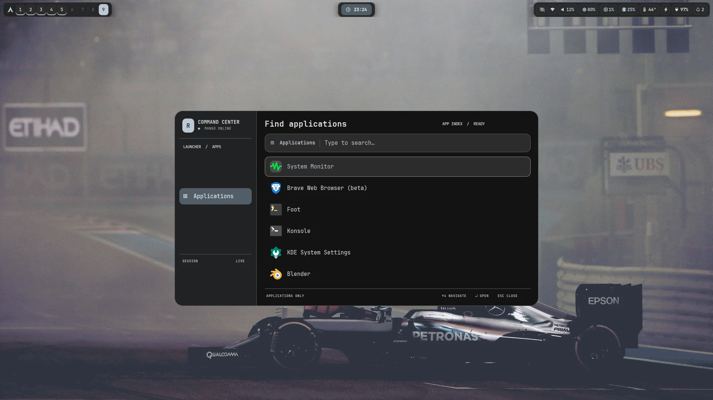
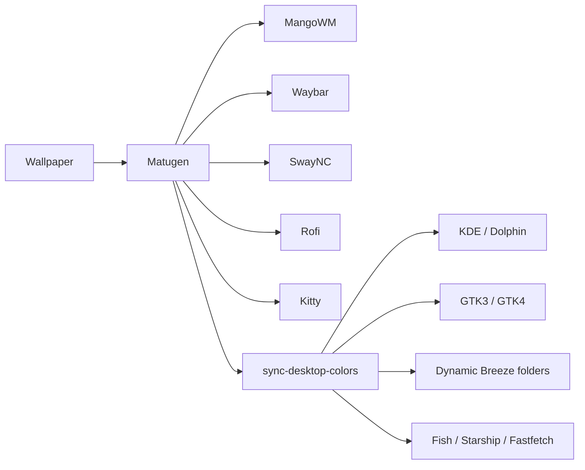

<div align="center">

# MangoWM Dotfiles

**A cohesive, wallpaper-driven Wayland desktop for Artix Linux.**

[](https://artixlinux.org/) [](https://wayland.freedesktop.org/) [](https://github.com/mangowm/mango) [](https://github.com/InioX/matugen)



<sub>MangoWM · Waybar · SwayNC · Rofi · Kitty · Matugen · OpenRC</sub>

<br><br>

[Showcase](#showcase) · [Features](#highlights) · [Install](#installation) · [Keybindings](#keybindings) · [Architecture](#dynamic-theming)

</div>

## Showcase

<table>
  <tr>
    <td width="50%">
      
      <br>
      <sub><b>Wallpaper gallery</b> — search, browse, preview, and recolor the complete desktop.</sub>
    </td>
    <td width="50%">
      
      <br>
      <sub><b>Command center</b> — a focused Rofi launcher using the generated palette.</sub>
    </td>
  </tr>
</table>

> One wallpaper selection regenerates a consistent palette across the compositor, shell, terminal, launcher, notifications, GTK, KDE, and folder icons.

This repository is an audited snapshot of the active desktop—not a loose collection of example configs. It excludes credentials, personal media, caches, generated binaries, and stale settings from other desktop sessions. The complete inclusion policy lives in [`AUDIT.md`](AUDIT.md).

## Desktop stack

| Layer | Choice |
|---|---|
| Distribution / init | Artix Linux / OpenRC |
| Login / session | SDDM / Wayland |
| Compositor | MangoWM |
| Bar / notifications | Waybar / SwayNC |
| Launcher / terminal | Rofi / Kitty |
| Shell / prompt | Fish / Starship |
| Wallpaper / colors | Custom Qt gallery / Matugen SchemeSmart |
| Audio / network | PipeWire + WirePlumber / NetworkManager |
| Desktop integration | Dolphin + KDE colors + GTK3/GTK4 CSS |

## Highlights

- **One-command recoloring.** Matugen propagates the wallpaper palette through MangoWM, Waybar, SwayNC, Rofi, Kitty, Fish, Starship, Fastfetch, KDE, GTK, and Breeze folder icons.
- **Purpose-built desktop tools.** Native Qt wallpaper gallery, NetworkManager Wi-Fi popup, and volume/brightness OSD.
- **Responsive workflow.** Nine tags, directional navigation, touchpad gestures, blur, animations, scratchpads, and a compact status bar.
- **Event-driven status.** Custom Mango tag indicators update from compositor IPC instead of polling through `jq`.
- **Audited deployment.** The installer adapts hardware names, builds local tools from source, configures OpenRC services, and backs up every conflict.
- **Repeatable installation.** Identical files and matching symlinks are left untouched, making subsequent installs idempotent.

## Installation

### Supported target

The automatic package and service setup targets **Artix Linux with OpenRC**. Config-only installation is possible on another Arch-family environment with the skip options described below.

### Normal installation

```bash
git clone https://github.com/alertxsto/mangowm-dotfiles.git ~/mangowm-dotfiles
cd ~/mangowm-dotfiles
./install.sh
```

The installer may request `sudo` for packages and system OpenRC services. It runs AUR package builds as the regular user.

After installation:

1. Put at least one `.jpg`, `.jpeg`, `.png`, or `.webp` image under `~/Pictures`.
2. Log out.
3. Select **Mango** in SDDM.
4. Log back in.
5. Press `Super+W` to choose a wallpaper, or run `theme-wallpaper /path/to/image`.

A generated fallback palette is included, so Waybar and the desktop remain usable even before a wallpaper is available.

### Installer options

```text
--target-home PATH  Install into PATH instead of $HOME
--skip-packages     Do not install pacman/AUR packages
--skip-services     Do not enable OpenRC services
--skip-build        Do not build the native Qt utilities
-h, --help          Show installer help
```

Examples:

```bash
# Install only the configuration files
./install.sh --skip-packages --skip-services

# Populate an isolated home for inspection
./install.sh \
  --target-home /tmp/mango-home \
  --skip-packages \
  --skip-services
```

When `--target-home` differs from `$HOME`, use `--skip-services`; user OpenRC services belong to the real login account.

## What `install.sh` does

1. Verifies that the package-install path is running on Artix Linux.
2. Bootstraps `yay` when necessary.
3. Installs repository and AUR dependencies listed in [`packages.txt`](packages.txt).
4. Copies the tracked home tree into the selected target home.
5. Replaces `__HOME__` placeholders with the actual target path.
6. Detects the Wi-Fi interface and backlight device.
7. Builds `network-popup`, `mango-osd`, and `wallpaper-overview` from source.
8. Enables required system and user OpenRC services.

### Existing-file safety

The installer never silently discards a conflicting file. Changed destinations are moved to:

```text
~/.dotfiles-backup/YYYYMMDD-HHMMSS-PID/
```

Identical files and matching symlinks are left in place. Re-running the installer is idempotent.

## Repository layout

```text
.
├── .config/
│   ├── mango/                 # compositor, rules, bindings, startup
│   ├── waybar/                # bar modules and styling
│   ├── swaync/                # notifications and control center
│   ├── rofi/                  # launcher
│   ├── kitty/                 # terminal
│   ├── matugen/               # color generator and templates
│   ├── fish/                  # shell startup and generated colors
│   ├── fastfetch/             # generated layout and image
│   ├── gtk-3.0/               # GTK3 palette integration
│   ├── gtk-4.0/               # GTK4/libadwaita integration
│   ├── fontconfig/            # icon-font fallback aliases
│   └── xsettingsd/            # GTK/XSettings bridge
├── .local/
│   ├── bin/                   # shell and Python helpers
│   └── share/
│       ├── network-popup/     # Qt Wi-Fi popup source
│       ├── mango-osd/         # Qt OSD source
│       ├── wallpaper-overview/# Qt wallpaper gallery source
│       └── color-schemes/     # KDE fallback color scheme
├── AUDIT.md                   # system audit and exclusions
├── packages.txt               # repository, AUR, and OpenRC packages
└── install.sh                 # installer, builder, and service setup
```

## Dynamic theming



The main entry point is:

```bash
theme-wallpaper /path/to/wallpaper.png
```

Without an argument, it uses this precedence:

1. The last selected wallpaper from `~/.cache/mango-theme/wallpaper`.
2. `~/Pictures/blinders.jpg` when present.
3. The first supported image under `~/Pictures`.
4. The tracked fallback palette when no image exists.

The theme command reloads MangoWM, Waybar, Kitty, and SwayNC after regenerating colors.

## Custom utilities

### `network-popup`

Qt Quick Wi-Fi frontend backed by `nmcli`.

- Scans and sorts access points by connection state and signal strength.
- Connects to open or secured networks.
- Opens `nmtui` for advanced configuration.
- Closes when focus leaves the popup.

Launch it from the Waybar network module.

### `mango-osd`

Qt Quick OSD backed by a per-user local socket.

```bash
mango-osd --server
mango-osd volume 70 0
mango-osd brightness 80
```

The server starts with MangoWM. `volume-control` and `brightness-control` send updates to it.

### `wallpaper-overview`

Full-screen Qt Quick wallpaper browser.

- Recursively scans the XDG Pictures directory.
- Groups images by folder.
- Supports category navigation and text filtering.
- Generates cached 16:9 previews.
- Applies the selected image through `theme-wallpaper`.

## Keybindings

### Applications and desktop

| Binding | Action |
|---|---|
| `Super+D` | Open Rofi |
| `Super+Return` | Open Kitty |
| `Super+E` | Open Dolphin |
| `Super+W` | Open wallpaper gallery |
| `Super+R` | Regenerate colors from the current wallpaper |
| `Super+Q` | Close focused client |
| `Super+M` | Exit MangoWM |

### Focus and window state

| Binding | Action |
|---|---|
| `Super+Arrow` | Focus in a direction |
| `Super+Shift+Arrow` | Exchange windows |
| `Super+V` | Toggle floating |
| `Super+F` | Toggle fullscreen |
| `Alt+A` | Toggle maximized screen state |
| `Alt+Shift+F` | Toggle fake fullscreen |
| `Super+G` | Toggle global/sticky state |
| `Super+I` | Minimize |
| `Super+Shift+I` | Restore minimized client |
| `Super+O` | Toggle overlay |
| `Alt+Z` | Toggle scratchpad |
| `Alt+Tab` | Jump between windows |
| `Super+N` | Switch layout |

### Tags and monitors

| Binding | Action |
|---|---|
| `Super+1..9` | View tag |
| `Super+Shift+1..9` | Move client to tag and follow |
| `Ctrl+Left/Right` | View adjacent tag |
| `Alt+Shift+Left/Right` | Focus adjacent monitor |
| `Super+Alt+Left/Right` | Move client to adjacent monitor |

### Geometry

| Binding | Action |
|---|---|
| `Super+Ctrl+Arrow` | Resize floating window |
| `Ctrl+Shift+Arrow` | Move floating window |
| `Alt+Shift+R` | Toggle gaps |
| `Alt+Shift+X/Z` | Increase/decrease gaps |
| `Super+left mouse` | Move/resize interaction |
| `Super+right mouse` | Resize interaction |

Hardware brightness and volume keys call the custom controls and display the OSD.

## Hardware adaptation

The checked-in configuration reflects the audited machine, but the installer rewrites two hardware-specific defaults:

- `wlan0` becomes the first non-P2P Wi-Fi interface reported by NetworkManager.
- `amdgpu_bl2` becomes the first device under `/sys/class/backlight`.

Manual overrides remain available:

```bash
BACKLIGHT_DEVICE=intel_backlight brightness-control up
BACKLIGHT_STEP=10 brightness-control down
VOLUME_STEP=2 volume-control up
```

## Updating

Pull changes and run the installer again:

```bash
cd ~/mangowm-dotfiles
git pull --ff-only
./install.sh
```

Changed local destinations are backed up before replacement.

To regenerate the desktop after editing a Matugen template:

```bash
theme-wallpaper
```

Validate the Mango config without starting another compositor:

```bash
mango -p -c ~/.config/mango/config.conf
```

## Troubleshooting

### Waybar does not start on login

Run it directly to inspect its configuration:

```bash
waybar --log-level debug
```

The Mango config intentionally runs `theme-wallpaper` before `waybar`. Do not split them into concurrent startup commands; the theme helper reload signal can race Waybar startup.

### No wallpaper is applied

```bash
find ~/Pictures -type f \( -iname '*.jpg' -o -iname '*.jpeg' -o -iname '*.png' -o -iname '*.webp' \)
theme-wallpaper /full/path/to/image.png
```

### Wi-Fi popup shows no networks

```bash
nmcli -t -f DEVICE,TYPE,STATE device
```

Re-run `install.sh` after changing hardware so it can adapt the interface before rebuilding the popup.

### Brightness keys fail

```bash
brightnessctl --list
BACKLIGHT_DEVICE=your_device brightness-control get
```

### Restore a replaced file

Find the newest backup:

```bash
find ~/.dotfiles-backup -maxdepth 2 -type f
```

Then copy the desired file back to its original relative path.

## Security and privacy

The repository does not track GitHub credentials, browser profiles, PulseAudio cookies, personal wallpapers, runtime databases, crash reports, caches, or session restore data. Generated native binaries are also excluded and rebuilt locally.

For the complete evidence-backed coverage list and intentional exclusions, read [`AUDIT.md`](AUDIT.md).
